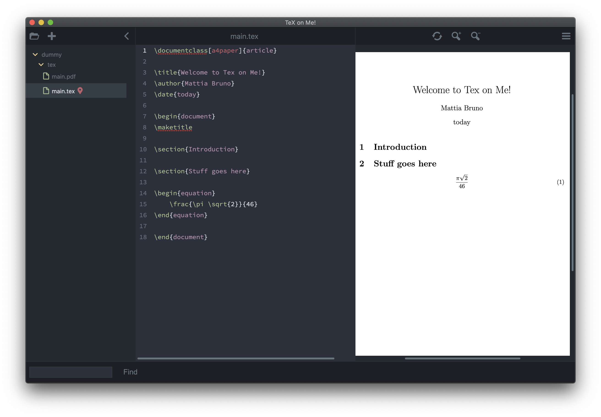

# ToM - Tex on Me

An intuitive TeX editor with a modern interface for the everyday physicist.

- **Website:** https://mbruno46.github.io/ToM/

### Authors

Copyright (C) 2021, Mattia Bruno

## Installation
