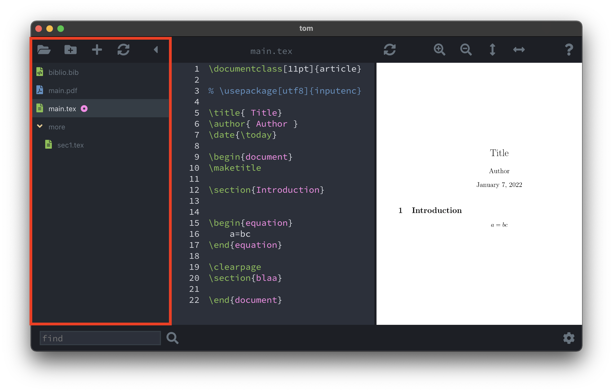
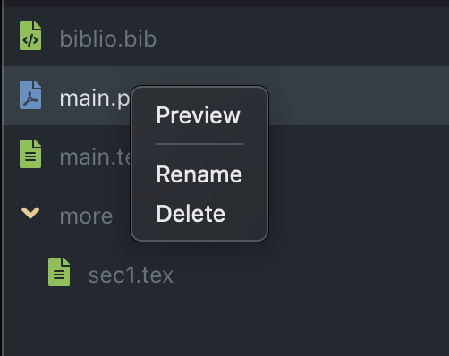
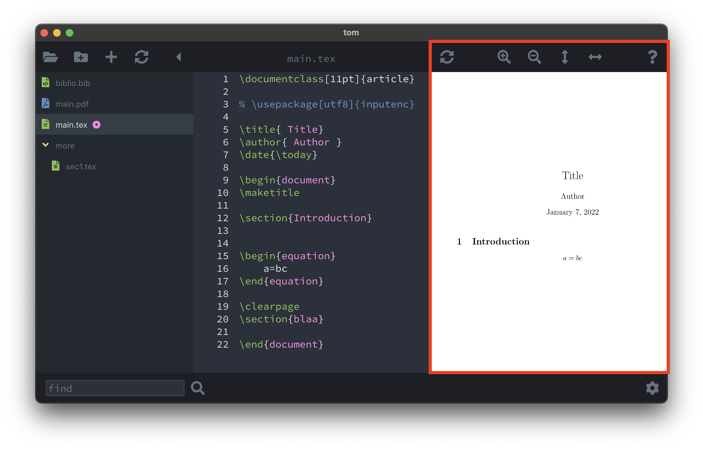
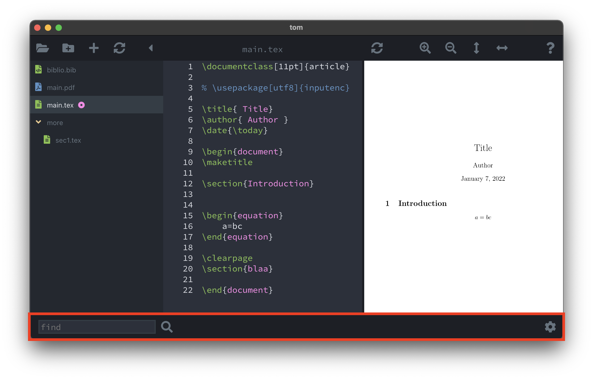
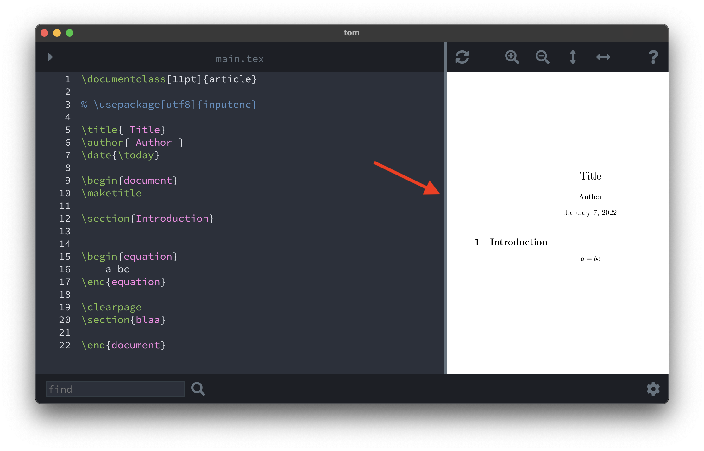

# Getting started

A project is a directory containing at least one `.tex` file.
If multiple `.tex` files are present the program will automatically
detect the *main* file, i.e. the file containing the line 
`\documentclass`. Note that only one file per project is allowed and 
expected to contain the `\documentclass` command.

## The Browser

A tree view of the relevant files inside the current project.

### Buttons

 * `Open folder`: opens a folder/project
 * `Create new folder`: creates a new folder in the current project
 * `Add file`: touches new files inside the current project
 * `Refresh`: refreshed the browser. Useful if the project folder is manipulated with external commands, like 
 the Terminal or Finder.
 * `Hide browser`: hides the browser providing more room to the editor and viewer panels.

By right-clicking an item in the browser the user can open a context menu

 * `Preview`: images such as pdf or png files are opened in the Preview program
 * `Rename`, `Delete`: renames or deletes the selected file

 ## The Editor

 The main editor to modify `.tex` or `.bib` files.

### Features

  * available shortcuts can be inspected by checking the `Edit` menu.
  * when the file is edited a `*` appears in the top toolbar together with a save button
  * autosaving is enabled and the time interval can be set in the preferences

### Autocompletion

When the user types, an autocompletion menu may automatically appear at the location
of the cursor. The suggestions include 

  * LaTeX commands, such as `\begin` when the user types `\b`
  * paths to `.tex` files (contained in the project) when the user types `\input{`
  * paths to `.bib` files when the user types `\bibliography{`
  * paths to images when the user types `\includegraphics[...]{`
  * labels extracted from the `.tex` files when the user types `\ref{`
  * article tags extracted from all `.bib` files when the user types `\cite{`

## The PDF Viewer

The main PDF document is display here.

### Buttons

  * `Sync`: recompiles the latex document and refreshes the PDF document without
  losing the focus on the current page
  * `Zoom In/Out`
  * `Fit horizontally/vertically`
  * `Help`: on click a popup context menu appears with LaTeX documentation and resources.

## Footer

The lower toolbar with a few additional features

  * **Find**: type the text you want to find in the opened `.tex` file and press the `Find` button.
  The editor will automatically scroll to the first istance, which will be selected.
  Successive clicks of the `Find` button will iterate over the additional instances.

  * **Preferences**: the settings panel is opened from the `Settings` button.

## Resizer

By moving the mouse in between the editor and the viewer, a vertical gray bar
shows up and by dragging it, it is possible to resize the editor and the
viewer.

