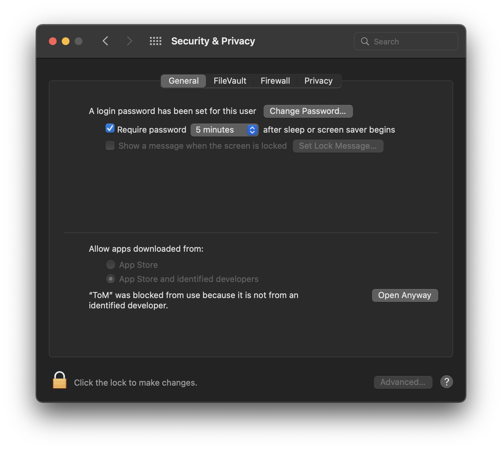

***

## Installation

Installers of the application for MacOS and Linux can be 
found [here](https://github.com/mbruno46/ToM/releases/latest).

### MacOS

Note: the authors of ToM are not official Apple Developers. By installing
ToM you accept this risk.

To install ToM in the `$HOME/Applications` folder run the following command
in a terminal

```bash
bash <(curl -Ls https://raw.githubusercontent.com/mbruno46/ToM/main/scripts/macos-installer.sh)
```

For a manual installation the latest version should be downloaded in `zip` format from the
GitHub release page. After unzipping the content, copy the extracted `ToM.App` folder to
the desired location.

At this point, any version of MacOS will prevent the usage of ToM, since its author is not an
official Apple Developer. To be able to use ToM, open `ToM.app` which will fail;
then go to `System preferences -> Security and privacy` and click on `Open Anyway` 
as illustrated below.


    
Alternatively, open a terminal and type

```bash
xattr -dr com.apple.quarantine /custom/path/to/ToM.app
```

### Updates

The user can verify if new updates are available in the settings panel of the app.
By clicking on download and install the app will close and will be automatically
updated.
